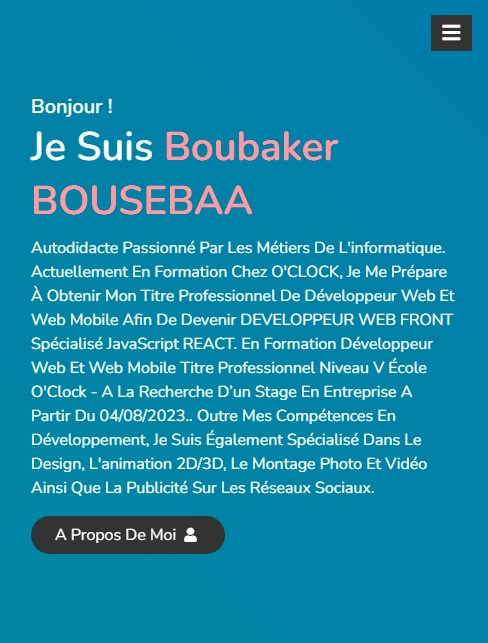
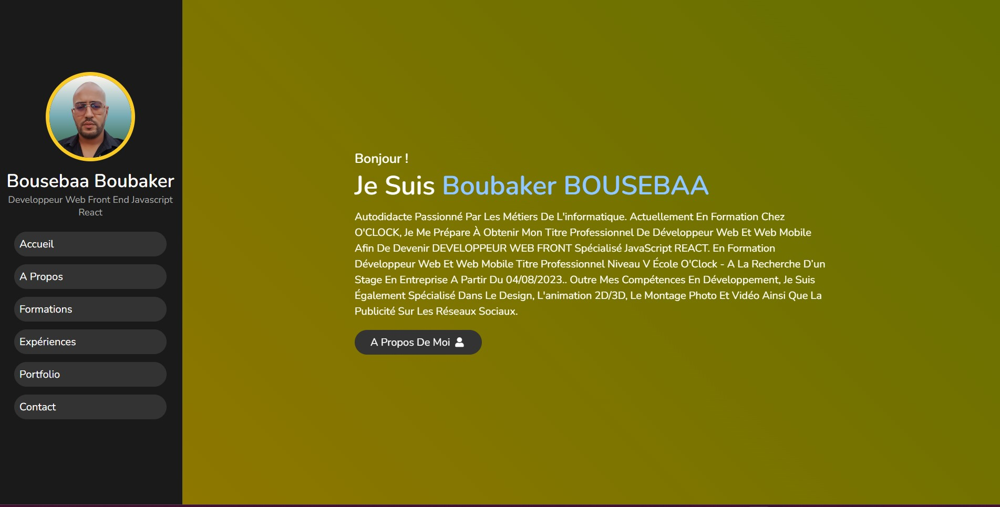

# CV_Boubaker_Bousebaa.github.io

Mon CV Portfolio design site web responsif en HTML/CSS et JS

# Hi, I'm Boubaker! 👋

## 🚀 About Me
I am a full stack developer... Self-taught passionate about IT jobs. Currently in training at O'CLOCK, I am preparing to obtain my professional title of Web and Mobile Web Developer in order to become a FRONT WEB DEVELOPER specialized in JavaScript REACT. Level V Professional Title - I am currently looking for an internship in a company from 04/08/2023. In addition to my development skills, I also specialize in design, 2D/3D animation, photo and video editing, as well as social media advertising.

Je suis un développeur full stack... Autodidacte passionné par les métiers de l'informatique. Actuellement en formation chez O'CLOCK, je prépare l'obtention de mon titre professionnel de Développeur Web Web et Mobile afin de devenir DÉVELOPPEUR WEB FRONT spécialisé en JavaScript REACT. Titre Professionnel de Niveau V - Je suis actuellement en recherche d'un stage en entreprise à partir du 04/08/2023. En plus de mes compétences en développement, je suis également spécialisé dans le design, l'animation 2D/3D, le montage photo et vidéo, ainsi que la publicité sur les réseaux sociaux. 

## 🛠 Skills
Github, Javascript, React, Angular, vue.JS, PHP, mySQL, HTML, CSS,...

## Screenshots

## Tech used

HTML, CSS, JavaSrcipt

